# Practical Work #1
## Application with common JavaEE architecture
### General task
You are to develop an application using common JavaEE architecture and technologies. It should have three layers (data, logic, view) and provide means to work with a database.
It is strongly recommended to use version control and source code management system (like GitHub).
It is strongly recommended to use Maven to manage your project.
You can choose any IDE, but IntelliJ IDEA is recommended.
You may not use IDE to deploy your project to an application server. All deployment should be made using administrative console.

### Task 1
Download GlassFish application server.
Install it by unpacking the archive.
Start the application server.
Open an administrative console and go through its controls.

### Task 2
If you have no DBMS installed, please install one. You can choose any SQL DBMS you like, but PostgreSQL and MySQL are preferred.

### Task 3
Choose any subject area and make a model with at least two entities with a few properties.
Create a script to make a database for your model.

### Task 4
Develop data layer as Java Beans for the model and make them prepared for use with Entity Persistence.

### Task 5
Implement business layer for accessing data using session beans.

### Task 6
Implement view layer using any technology of your choice, which is applicable here.

### Task 7
Make everything work together…

### Start the WildFly Server
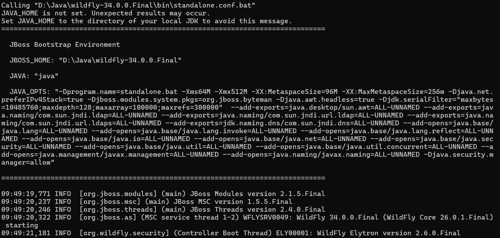

### Access the Server Management Console
Open the management console at http://localhost:9990/console/index.html
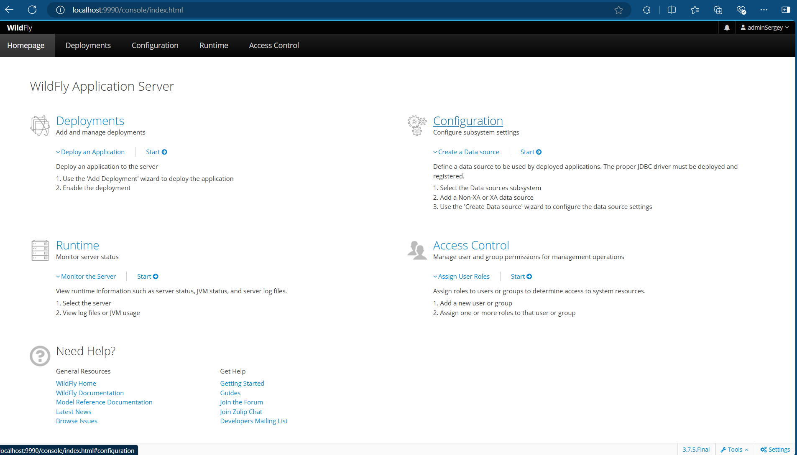

### Configure the PostgreSQL Database Connection
For stable operation with the PostgreSQL database, navigate to Configuration → Subsystems → Datasources & Drivers → Datasources and connect to your database:
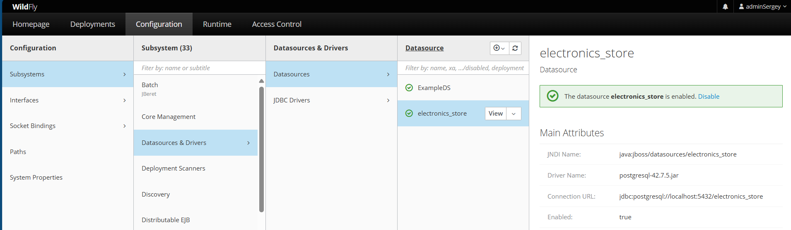

### Deploy the Application
Go to Deployments and deploy your application (a .war file) to the server:
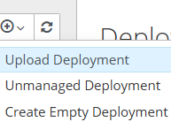
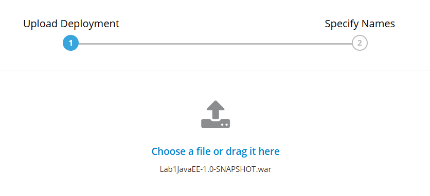
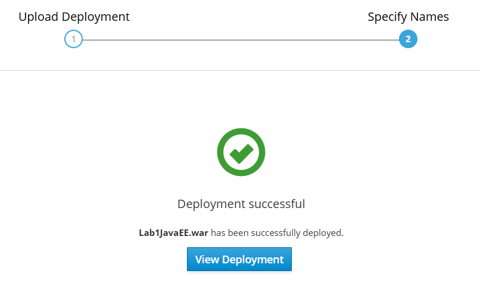

### Access the Application
After successful deployment, you can access the application's main page at http://127.0.0.1:8080/Lab1JavaEE/
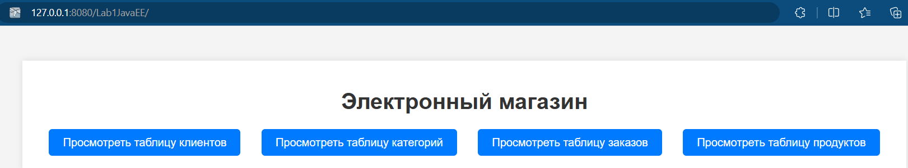

### Test the Application Functionality
Let's test the application using the Customers table. Access it via the link http://localhost:8080/Lab1JavaEE/customer-servlet
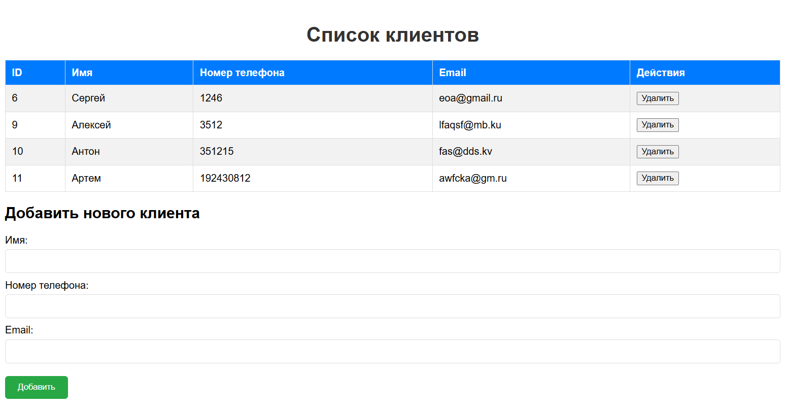

Add a new customer to the table:
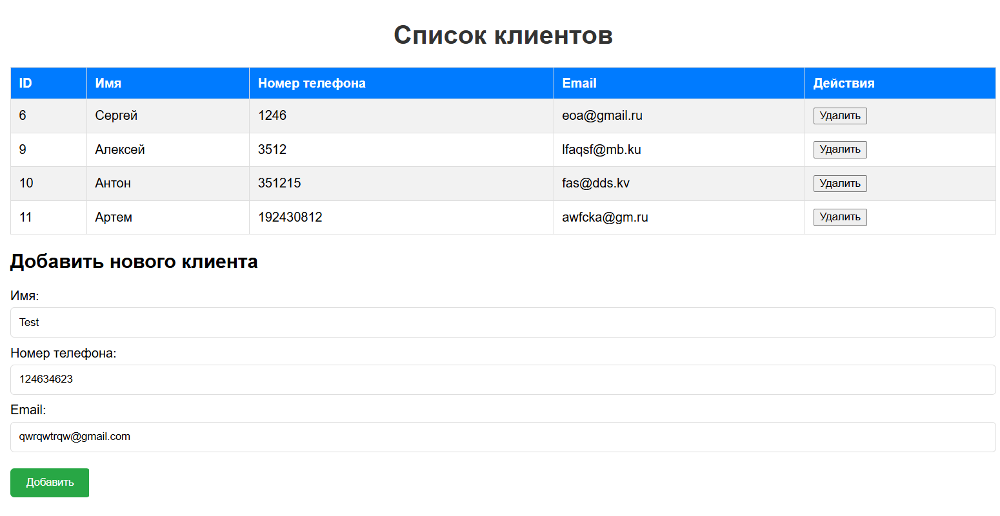
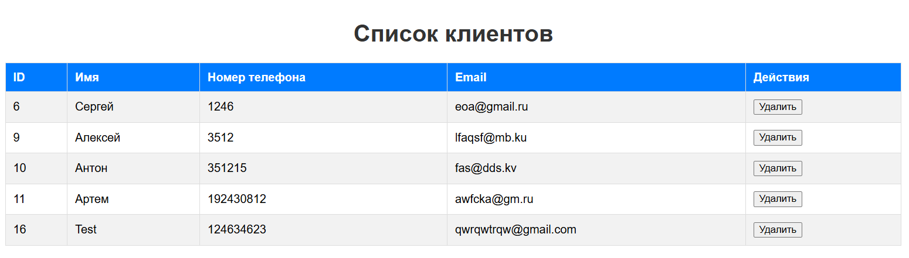

Delete the customer from the table:
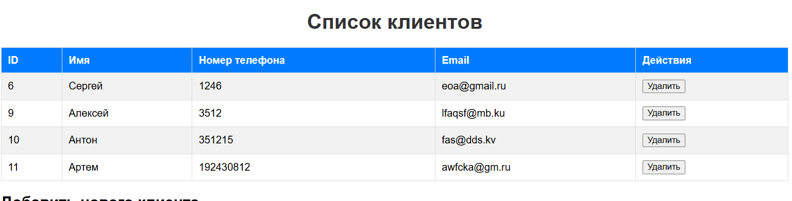

### Conclusion
The application is functioning stably without any errors. The operations of adding and deleting customers were successful, confirming that the application is working as expected.