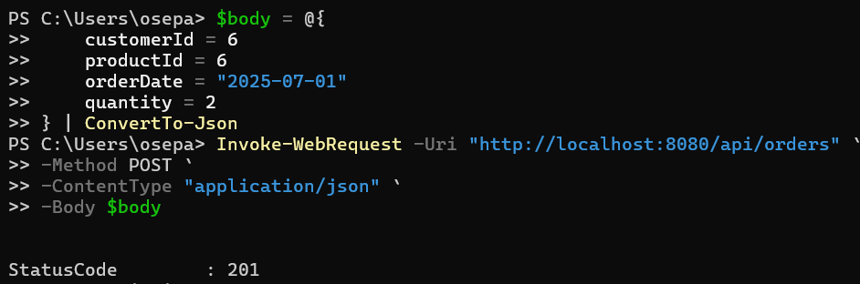

Practical Work #3
RESTful web-service
    
General task
You are to develop an application with REST web-service interface. Application should provide access to data within a database. It is strongly recommended to use version control and source code management system (like GitHub). It is strongly recommended to use Maven to manage your project. You can choose any IDE, but IntelliJ IDEA is recommended.
Task 1
Compare JAX-RS and SpringREST. Choose one of them for your application. Give some arguments for your choice.
Spring REST was chosen because it seamlessly integrates with the Spring ecosystem, reduces boilerplate code, and provides powerful tools for developing RESTful services within the existing Spring-based application.

Task 2
Choose one of your previous applications for further development. Develop a REST API for accessing your data.
The application from Lab 2 was selected.
[Controllers](src/main/java/com/electronicsstore/lab3restful/controller)
Task 3
Implement the API. It should allow usage of both XML and JSON.
Task 4
Develop an XSL transformation for your XML objects to make a browser able to show them as HTML pages (including object data and navigation to other entities and their lists).

Task 5
Add the XSLT to all XML responses.
[Categories](src/main/resources/static/categories.xsl)
[Customers](src/main/resources/static/customers.xsl)
[Orders](src/main/resources/static/orders.xsl)
[Products](src/main/resources/static/products.xsl)
Task 6
Make everything work together…

### Using the Orders Table as an Example:

By clicking on the ID, we can view the full hierarchy in XML format, including values from related tables:

By clicking on CustomerID, we can see the corresponding row from the Customers table:

By clicking on ProductID, we can see the corresponding row from the Products table:

### Adding a New Entry to the Table via WebRequest

The response code is 201, indicating that the request was successful. We can see that a new entry has been added to the table:

### Modifying the New Entry

The response code is 200, indicating that the request was successful. We can see that the row has been updated:

### Deleting the Entry from the Table

The response code is 204, indicating that the request was successful. We can see that the row has been removed from the table:
